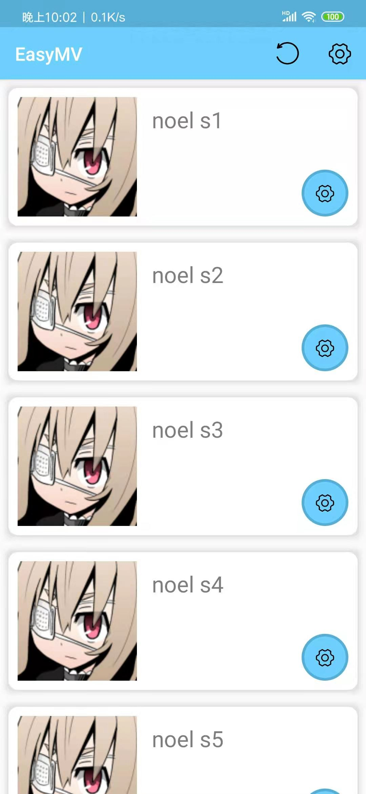
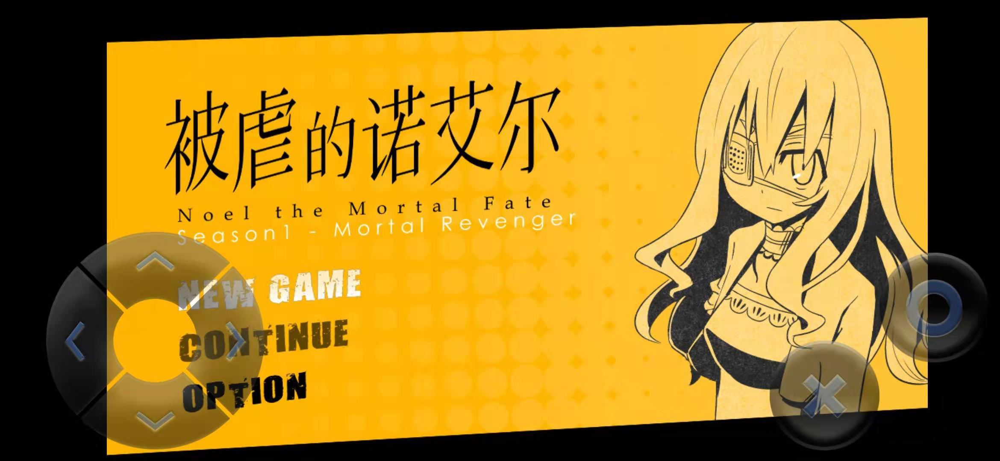

## EasyMV-AndroidRPGMVPlayer

A simple webview player app to play RPGMV games on Android platform.

[中文说明](README.zh.md)

# Introduction

Games generated by RPGMakerMV run on web pages. Theoretically them have the potential to be transplanted to Android platform. But there are few good tools.

* [mv-android-client](https://github.com/AltimitSystems/mv-android-client)The project can pack RPGMV game into an APK, but it needs Android studio to compile, which is very troublesome.
  * And once you uninstall APK, the game savings disappears.
* [AndroidLocalStorage](https://github.com/didimoo/AndroidLocalStorage) provides a way to store `localstorage` locally, but the project cannot work.
  * The project works after modification, but it stuck seriously and its performance is extremely poor.

EasyMV refers to the above two projects and has the following characteristics:

* Save the game in the game directory. game status persists even if EasyMV is uninstalled.
* Simply use. Put the `www` folder in the search path, then you can play games.
* Solve the problem that `.m4a` file cannot be found on mobile devices.
* Rendering and sound can automatically set up by bootstraper .

# How to use

1. Find the `www` folder in the game directory, which should contain an `index.html `。
2. Copy the `www` folder out and rename it.
3. Many renamed `www` games are placed in the same directory.
4. Add this directory to EasyMV (the setting button in the upper right corner).
5. Change the settings and play happily.

# Hint

* `www/icon/ icon.png ` is considered as the icon of the game.
* game savings are at ` www/save/EasyMV.save`
* The configuration file of EasyMV is saved in ` www/EasyMV.properties `
* The title in the settings can be different from the folder name (you can even enter multiple lines of text).
* If you need to inject JavaScript into the game, you can directly modify `index.html`.
