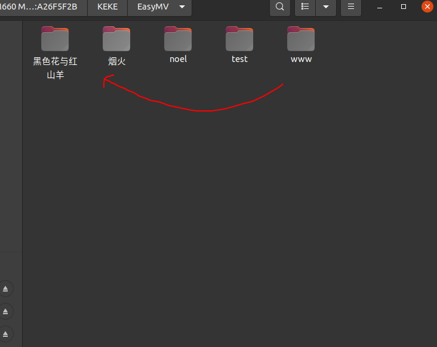

## EasyMV-AndroidRPGMVPlayer

A simple webview player app to play RPGMV games on Android platform.

Author: KEKE_046

Version: v1.1.0

Github Repo: [EasyMV-AndroidRPGMVPlayer](https://github.com/KEKE046/EasyMV-AndroidRPGMVPlayer)

[中文说明](README.zh.md)

# Introduction

EasyMV refers to the above two projects and has the following characteristics:

* Save the game in the game directory. game status persists even if EasyMV is uninstalled.
* Simple to use. Put the `www` folder in the search path, then you can play games.
* Provide fake_greenworks.js. Games calling greenworks.js to send messages to steam can also be launched.
* Provide virtual gamepad.
* Manually starting mode, solving the problem of checking steam appid on game starting.
* Solve the problem that `.m4a` file cannot be found on mobile devices.
* Rendering and sound can automatically set up by bootstraper .


# How to use

1. Find the `www` folder in the game directory, which should contain an `index.html `。
2. Copy the `www` folder out and rename it.
3. Many renamed `www` games are placed in the same directory.
4. Add this directory to EasyMV (the setting button in the upper right corner).
5. For many games, you may need to change the audio ext to `use .ogg`.
6. Change the settings and play happily.

```
gamedir
|-- noel s1(rename the www folder to what you want)
|   |-- index.html
|   |-- ......
|-- noel s2(rename the www folder to what you want)
|   |-- index.html
|   |-- ......
|-- ......
```

## Launch "Noel the Mortal Fate"


1. put `www` folder to your game directory.
2. open settings and set `Force Audio Extension` to `use .ogg`.

## Launch "Fireworks"


1. put `www` folder to your game firectory.
2. open settings and switch on these `Manually Start`, `Add Gamepad`, `Use Fake greenworks.js`.
3. recommend to open `Show FPS`.


# Hint

* `www/icon/ icon.png ` is considered as the icon of the game.
* game savings are at ` www/save/EasyMV.save`
* The configuration file of EasyMV is saved in ` www/EasyMV.properties `
* The title in the settings can be different from the folder name (you can even enter multiple lines of text).
* many API are not implemented in `fake_greenworks.js`, you can implement what you want and inject it into `index.html`.
* If you need to inject JavaScript into the game, you can directly modify `index.html`.
* Noel is so cute, that I make this repo. I highly recommend the game "**Noel the Motal Fate**".

# Reference

Games generated by RPGMakerMV run on web pages. Theoretically them have the potential to be transplanted to Android platform. But there are few good tools.

* [mv-android-client](https://github.com/AltimitSystems/mv-android-client)The project can pack RPGMV game into an APK, but it needs Android studio to compile, which is very troublesome.
  * And once you uninstall APK, the game savings disappears.
* [AndroidLocalStorage](https://github.com/didimoo/AndroidLocalStorage) provides a way to store `localstorage` locally, but the project cannot work.
  * The project works after modification, but it stuck seriously and its performance is extremely poor.

# tutorial

find your game
<details>


</details>

find the www folder
<details>


</details>

check the index.html
<details>


</details>

copy www folder into your phone storage, Note: I copied it to **EasyMV** folder.
<details>


</details>

rename the www folder.
<details>


</details>

open your EasyMV, press the add button in the toolbar.
<details>


</details>

press the add button in the toolbar to add the **EasyMV** folder into the search paths.
<details>


</details>

game visible in the game list.
<details>


</details>

you can change the settings in your need
<details>


</details>

start the game
<details>


</details>